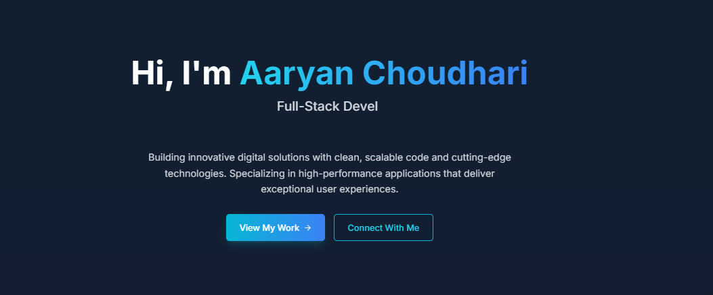

# Project Title PortFolio

## Posters

## Description
This project is designed to [insert detailed description of the project, its purpose, and features here].

## Installation
To install the project, follow these steps:
1. Clone the repository: `git clone [repository-url]`
2. Navigate to the project directory
3. Install the dependencies: `npm install` or `yarn install`

## Usage
To use the project, follow these instructions:
1. Start the application: `npm run dev` or `yarn run dev`
2. Open your browser and navigate to `http://localhost:5173`

